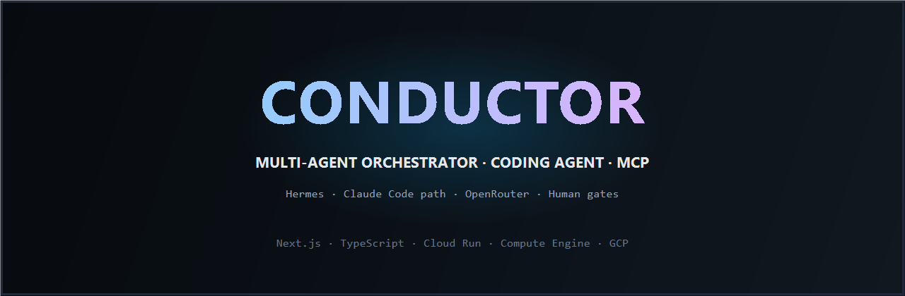

<p align="center">
  
</p>

<p align="center">
  <a href="https://conductor-operator-95044197271.asia-south1.run.app">
    
  </a>
  <a href="https://conductor-operator-95044197271.asia-south1.run.app">
    
  </a>
</p>

<p align="center">
  
  
  
  
  
  <br/>
  
  
</p>

<p align="center">
  <strong>Multi-Agent Orchestrator + Coding Agent control plane — Hermes plans &amp; verifies, specialists execute, humans approve risk.</strong>
</p>

<p align="center">
  <b>Live:</b>
  <a href="https://conductor-operator-95044197271.asia-south1.run.app"><strong>https://conductor-operator-95044197271.asia-south1.run.app</strong></a>
</p>

<p align="center">
  <a href="#what-is-conductor">What is Conductor?</a> ·
  <a href="#capabilities">Capabilities</a> ·
  <a href="#architecture">Architecture</a> ·
  <a href="#live-deployment">Live deployment</a> ·
  <a href="#quick-start">Quick start</a> ·
  <a href="#project-layout">Project layout</a>
</p>

---

## What is Conductor?

**Conductor** is a production-minded **multi-agent operator control plane** for teams that need more than a single chat window.

It implements a **dual-stack architecture**:

| Layer | Responsibility |
|-------|----------------|
| **Orchestrator (Hermes)** | Memory, routing, delegation briefs, verification, status reporting |
| **Coding agent path** | Repo work, tests, PR summaries, file-level execution |
| **MCP tool fabric** | Shared tools between orchestrator and specialists |
| **Human gates** | High-risk approvals — **no auto-merge to main** |

Client-facing story: *Multi-Agent Orchestrator · Coding Agent (Hermes · Multi-Agent stack · MCP)*.

---

## Capabilities

- **Operator UI** — Overview, kanban board, task detail, approvals queue, audit log, architecture, policy settings  
- **Delegation briefs** — Objective, why it matters, done criteria, boundaries, return format  
- **Status machine** — `queued → working → needs_human → done | failed`  
- **Audit trail** — Append-only hand-offs across Hermes, coding agent, and humans  
- **Channel intake API** — CLI / scheduled / agent posts into the board  
- **Cloud footprint** — Google **Cloud Run** (operator) + **Compute Engine** (always-on orchestrator process)

---

## Architecture

```
Intake (CLI · cron · messaging)
        ↓
   Hermes (orchestrator · OpenRouter)
        ↔ MCP ↔
   Coding agent path (execution)
        ↓
   Conductor Operator (gates · audit · board)
        ↓
   Human approve  —  auto_merge_main = false
```

**Golden rule:** Hermes plans and verifies. The coding agent executes. Humans approve risk.

---

## Live deployment

| Surface | Target |
|---------|--------|
| **Operator (web)** | **[Open live control plane →](https://conductor-operator-95044197271.asia-south1.run.app)** |
| **Direct URL** | `https://conductor-operator-95044197271.asia-south1.run.app` |
| **Orchestrator host** | GCE `conductor-hermes` · `asia-south1-a` |
| **Models** | OpenRouter free routing (`openrouter/free`) by default |

Use the live operator for board, approvals, and audit.

---

## Quick start

```bash
git clone https://github.com/Atif1299/conductor-agent-ops.git
cd conductor-agent-ops
cp .env.example .env   # add provider keys locally — never commit secrets
npm install
npm run seed
npm run dev            # http://localhost:3300
```

GCP helpers (already used in production wiring):

- `deploy.ps1` — Cloud Run operator  
- `infra/gce-hermes.ps1` — Compute Engine Hermes host  

---

## Project layout

```
apps/operator/          Next.js control-plane UI + API
packages/contracts/     Shared Zod schemas (brief, task, audit)
sample-target/          Coding playground / scenario target
scenarios/              Delegation brief fixtures
configs/                Hermes OpenRouter configs (examples)
infra/                  GCE provision + remote configure
docs/assets/            Brand banner
docs/proof/             Architecture proof assets
```

---

## Stack

| Area | Choice |
|------|--------|
| UI / API | Next.js 15 · React 19 · TypeScript 5 |
| Contracts | Zod monorepo package |
| Orchestrator | Hermes Agent |
| Models | OpenRouter |
| Deploy | Google Cloud Run · Compute Engine |

---

## Production posture

- High-risk work requires **human approval**  
- **Auto-merge to main is disabled** in the control plane  
- Durable board store on GCS when `GCS_BUCKET` is set  
- Secrets only via environment / gitignored `.env`

---

## License

Private / portfolio — contact the author for commercial use.
